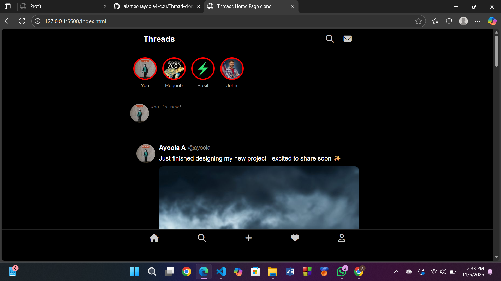

# 🧵 Threads Clone by [Ayoola.dev](https://ayoola.dev)

A clean, responsive Threads-style social media frontend built with **HTML** and **CSS** .
This project focuses on UI precision, modern design patterns, and smooth layout responsiveness — inspired by Meta’s Threads app.

---

### 🚀 Live Demo

### 💻 View Code

---

### 🧰 Tech Stack
- **HTML5** – Semantic and accessible structure  
- **CSS3** – Custom styling with media queries  
- **JavaScript (Vanilla)** – Basic interactivity  
- **Vercel** – Hosting and deployment  

---

<!-- ### 🌈 Brand Theme
- **Primary:** Dark Navy `#0B132B`  
- **Accent:** Cyan `#00E0C7`  
- **Font:** Clean, minimal, and modern UI style  

--- -->

### 📸 Preview

---

### 👨‍💻 About the Developer
**Ayoola Adedeji** — Frontend Developer passionate about building elegant interfaces and bringing clean, functional designs to life.  
<!-- Check out more projects and portfolio updates at 👉 [**Ayoola.dev**](https://ayoola.dev) -->

---

> _“Design is not just what it looks like and feels like. Design is how it works.”_ 